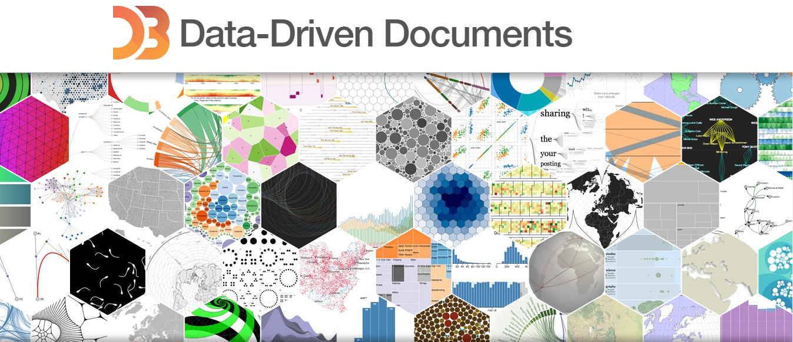

  
  &nbsp;&nbsp;
  

# 📊 Cours Data Visualization avec D3.js — ISI

> **Formateur :** Robert | **Établissement :** ISI (Institut Supérieur d'Informatique)
> **Niveau :** Licence 2 (Data Science & Big Data)

Ce dépôt contient les supports du cours de visualisation de données avec D3.js, de l'introduction aux dashboards interactifs.

---

## 📚 Supports de cours

| # | Chapitre | Lien |
|---|----------|------|
| 1 | Introduction à la Data Visualisation | [📄 1-Introduction_data_viz.pdf](1-Introduction_data_viz.pdf) |
| 2 | Introduction à D3.js | [📄 2-intro_D3js.pdf](2-intro_D3js.pdf) |
| 3 | Sélection & manipulation du DOM | [📄 3-d3_Selection_manipulation.pdf](3-d3_Selection_manipulation.pdf) |
| 4 | Création de graphiques de base | [📄 4-Création de Graphiques de Base.pdf](4-Création%20de%20Graphiques%20de%20Base.pdf) |
| 5 | Transitions, animations & interactions | [📄 5-Transition, animation et interaction.pdf](5-Transition%2C%20animation%20et%20interaction.pdf) |
| 6 | Graphiques avancés | [📄 6-graphique_avancé.pdf](6-graphique_avancé.pdf) |
| 7 | TD final D3.js | [📄 7-TD_fin_D3js.pdf](7-TD_fin_D3js.pdf) |
| 8 | Dashboard D3.js | [📄 8-dashboardD3.pdf](8-dashboardD3.pdf) |

---

## 🏋️ Exercices & TDs

Les exercices pratiques sont dans [`exercices/`](exercices/).

---

## 🔗 Autres cours

| Cours | Lien |
|-------|------|
| JavaScript | [CoursJS](https://github.com/Robsroberto/CoursJS) |
| Python | [CoursPython](https://github.com/Robsroberto/CoursPython) |
